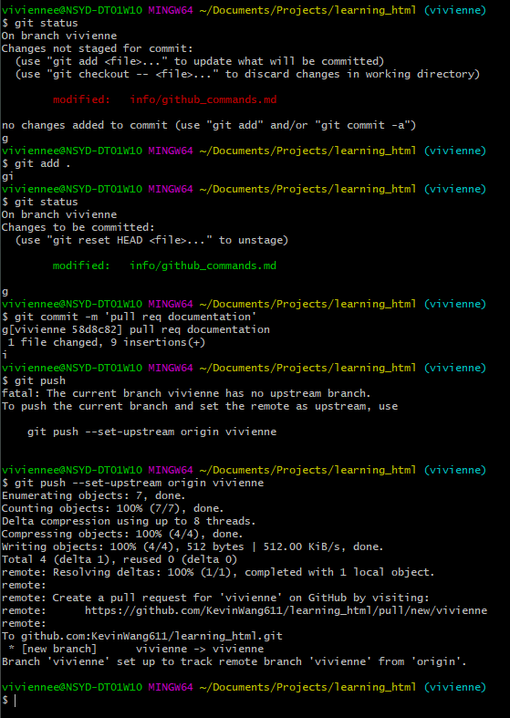

# GitHub Commands

## Delete branches
```bash
# delete your local branch
git branch -d name_of_branch

# delete your remote branch
git push origin --delete name_of_branch
```

## Create branch

````bash
# Create a non existing branch locally
# and then checkout there
git checkout -b name_of_branch
````

## Moving to another branch

```bash
git checkout name_of_branch
```

## Merge local branch with master

```bash
# Go to master branch, and make sure that your copy is updated
git checkout master
git pull
# Go to the branch that you wanted to update
git checkout name_of_branch
# Merge changes of master in your local branch
git merge master
```

## Pull Request

Merge changes from a branch to the master

* Create branch if it doesn't exist yet (see tutorial above)
* `git status` Commit changes locally, in your local branch (see tutorial above)
* Push your local branch changes to origin (GitHub). You want your local branch to be in GitHub because you would have to **open a pull request** using the web browser.




* Go to the project's URL, and look for your branch. Click **Merge pull request**.


